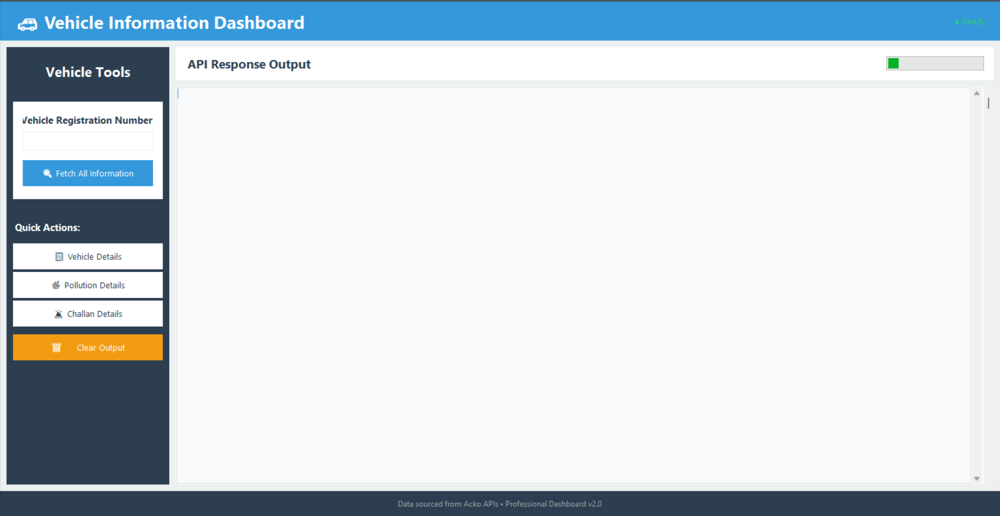

<h1 align="center">🚗 Vehicle Info Tool (Python GUI)</h1>

  <b>A simple Python GUI-based tool to fetch and display vehicle information.</b>

<h2>📌 About the Project</h2>

Vehicle Info Tool ek <b>Python GUI application</b> hai jo user se vehicle number input leta hai
aur uske related details show karta hai.  
Ye project beginners aur Python GUI learners ke liye best hai.

---

<h2>🛠️ Built With</h2>
<ul>
  <li>🐍 Python</li>
  <li>🖼️ Tkinter (GUI)</li>
  <li>🌐 API / Local Database (optional)</li>
</ul>

---

<h2>✨ Features</h2>
<ul>
  <li>User-friendly GUI interface</li>
  <li>Vehicle number input system</li>
  <li>Instant vehicle information display</li>
  <li>Error handling for invalid input</li>
  <li>Beginner-friendly code structure</li>
</ul>

---

<h2>📸 Screenshot</h2>

(Add your GUI screenshot here)

<pre>

</pre>

---

<h2>⚙️ Installation</h2>

<h3>1️⃣ Clone the Repository</h3>
<pre>
git clone https://github.com/your-username/vehicle-info-tool.git
cd vehicle-info-tool
</pre>

<h3>2️⃣ Install Requirements</h3>
<pre>
pip install -r requirements.txt
</pre>

<h3>3️⃣ Run the Application</h3>
<pre>
python main.py
</pre>

---

<h2>📂 Project Structure</h2>
<pre>
vehicle-info-tool/
│── main.py
│── gui.py
│── requirements.txt
│── README.md
│── assets/
│   └── screenshot.png
</pre>

---

<h2>🧠 How It Works</h2>
<ol>
  <li>User vehicle number enter karta hai</li>
  <li>Program input validate karta hai</li>
  <li>Vehicle data fetch hota hai</li>
  <li>GUI par details display hoti hain</li>
</ol>

---

<h2>🚀 Future Improvements</h2>
<ul>
  <li>Real-time government API integration</li>
  <li>Export data to PDF / CSV</li>
  <li>Modern UI design</li>
  <li>Dark mode support</li>
</ul>

---

<h2>🤝 Contributing</h2>

Contributions are welcome!  
Feel free to fork this repository and submit a pull request.

---

<h2>📄 License</h2>

This project is licensed under the <b>MIT License</b>.

---

<h2>👨‍💻 Author</h2>

<b>Your Name</b> 
GitHub: <a href="https://github.com/your-username">your-username</a>

⭐ If you like this project, give it a star on GitHub!

